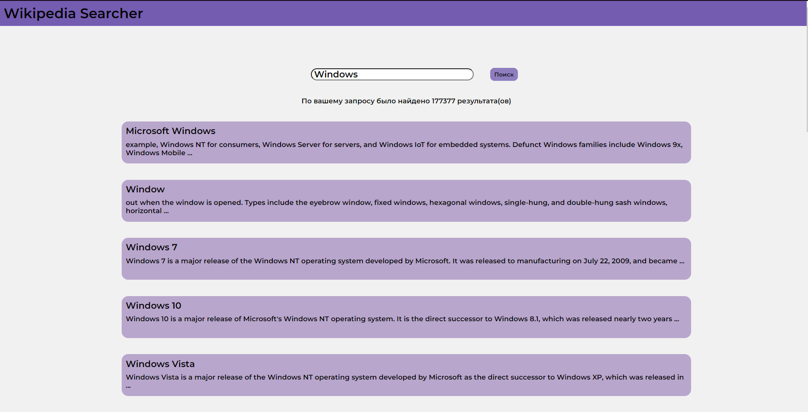

# WikiSearcher

Данный сайт позволяет искать нужные статьи Википедии по запросу пользователя

Для реализации использовались такие модули как **_mobX_** и **_mobX-react-lite_** 

Для поиска нужной статьи пользователь может ввести запрос в окне поиска и нажать Enter или кнопку "Поиск". В результате пользователь может открыть любую из предложенных статей 

